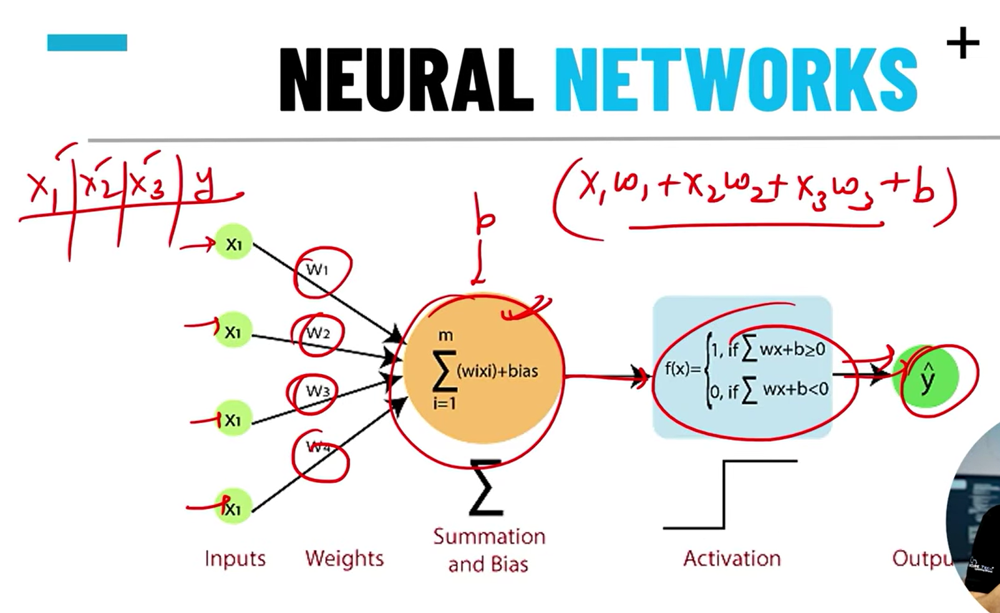

### what is DL?
-  DL  Artificial neural network(ANN) ka use karta h (same concept human brain se inspired hai)
- ML works on algorithm.

- Deep Learning ek aisa system hai jo data se automatically features aur patterns seekh leta hai — bina manually rules likhe hue.

### what is Neural network?

x1w1+x2w2+x3w3 + b  ( here, b->bias )

- This neural network is called single layer perceptron.

### 🔸 Traditional ML Approach:

* Tumhe manually features likhne padte the:

  * "Ear shape", "Tail size", "Color", "Legs count", etc.
* Fir classifier lagate the (SVM, Decision Tree, etc.)

### 🔸 Deep Learning Approach:

* Deep Learning model (CNN) **khud seekh leta hai**:

  * 1st layer → Detects edges
  * 2nd layer → Detects shapes (ears, eyes)
  * 3rd layer → Detects full object (dog or cat)

Yani manually kuch define nahi karna — model **automatically feature extraction karta hai** 🔥

---

## ⚙️ **How Deep Learning Works (Step-by-Step)**

### 1️⃣ **Input Data**

Model ko large dataset diya jata hai
(e.g., millions of images, text sentences, or audio samples)

### 2️⃣ **Neural Network Layers**

Ye model multiple layers me divide hota hai:

* **Input Layer:** raw data input
* **Hidden Layers:** pattern learning
* **Output Layer:** final prediction (e.g., “Dog”)

### 3️⃣ **Forward Propagation**

Data ek layer se dusri layer me flow karta hai, har neuron weight × input + bias calculate karta hai → activation function lagta hai.

### 4️⃣ **Loss Function**

Model apne predicted output aur actual output me difference nikalta hai (error).

### 5️⃣ **Backpropagation**

Error ko peeche propagate karke model ke **weights adjust** karta hai taaki next time better prediction ho.

### 6️⃣ **Repeat**

Ye process **billions of times** repeat hoti hai jab tak model accurate na ho jaye.

👉 Algorithms used: **Gradient Descent + Backpropagation**

---

## 🧩 **Why “Deep”?**

“Deep” ka matlab hai — **network me zyada layers** hona.
Jaise:

* 3 layers → Shallow Neural Network
* 100+ layers → Deep Neural Network

Zyada layers = zyada abstraction aur complex patterns seekhne ki ability.

---

## 💡 **Deep Learning ke Common Architectures**

| Type            | Full Form                      | Used For                            |
| --------------- | ------------------------------ | ----------------------------------- |
| **ANN**         | Artificial Neural Network      | General tasks                       |
| **CNN**         | Convolutional Neural Network   | Image & Vision                      |
| **RNN**         | Recurrent Neural Network       | Sequence (text/audio)               |
| **LSTM / GRU**  | Advanced RNN                   | Long-term dependencies              |
| **Transformer** | (e.g. GPT, BERT)               | Text, language, multimodal          |
| **GAN**         | Generative Adversarial Network | Image/Video generation              |
| **Autoencoder** | Encoder-Decoder structure      | Dimensionality reduction, denoising |
