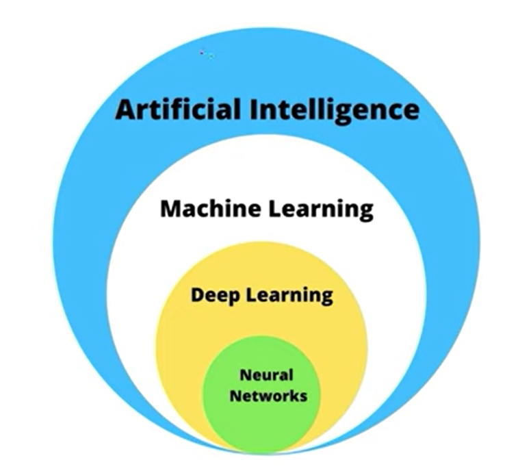

# 🧠 Artificial Intelligence (AI) — Complete Hierarchy

## 🤖 Artificial Intelligence (AI)
│  
│──> **Machine Learning (ML)** ← *AI ka subset*  
│     │  
│     ├──> **Supervised Learning**  
│     │       ├── Linear Regression  
│     │       ├── Logistic Regression  
│     │       ├── Decision Tree  
│     │       ├── Random Forest  
│     │       └── SVM, KNN, Naive Bayes  
│     │  
│     ├──> **Unsupervised Learning**  
│     │       ├── K-Means Clustering  
│     │       ├── Hierarchical Clustering  
│     │       └── PCA (Dimensionality Reduction)  
│     │  
│     ├──> **Semi-Supervised Learning**  
│     │  
│     └──> **Reinforcement Learning**  
│             ├── Q-Learning  
│             ├── SARSA  
│             └── Deep Q-Networks (DQN)  
│  
│  
│──> **Deep Learning (DL)** ← *ML ka subset*  
│     │  
│     ├──> Neural Networks (ANN)  
│     ├──> CNN (Convolutional Neural Network) → *Image Processing*  
│     ├──> RNN (Recurrent Neural Network) → *Sequential Data*  
│     ├──> LSTM / GRU → *RNN ke advanced versions*  
│     ├──> GAN (Generative Adversarial Network)  
│     ├──> Transformer Architecture (BERT, GPT etc.)  
│     │  
│     └──> **Generative AI (GenAI)** ← *DL ka subset*  
│            │  
│            ├──> **Large Language Models (LLMs)**  
│            │       ├── GPT (OpenAI)  
│            │       ├── Claude (Anthropic)  
│            │       ├── Gemini (Google)  
│            │       └── LLaMA (Meta)  
│            │  
│            ├──> **Diffusion Models**  
│            │       ├── Stable Diffusion  
│            │       └── DALL·E  
│            │  
│            ├──> **GAN-based Generative Models**  
│            │       └── Deepfake (Fake videos/images)  
│            │  
│            └──> **Audio / Voice Models**  
│                    ├── Voice Cloning  
│                    └── Music Generation  
│  
│  
│──> **Natural Language Processing (NLP)**  
│     ├── Text Classification  
│     ├── Sentiment Analysis  
│     ├── Translation  
│     └── Chatbots *(LLMs ka use hota hai yahan)*  
│  
│  
│──> **Computer Vision (CV)**  
│     ├── Image Classification  
│     ├── Object Detection (YOLO, SSD)  
│     ├── Image Segmentation (U-Net)  
│     └── Deepfake *(CV + GenAI ka intersection)*  
│  
│  
└──> **Robotics**  
       ├── Path Planning  
       ├── Motion Control  
       └── AI-based Automation  

### 📘 **Generative AI**

* **Generative AI** ek aisa Artificial Intelligence system hai
  jo **naya content generate kar sakta hai**, jaise — **text, image, video, audio, ya code**.
* Ye models **training data ke patterns** ko samajh kar **new and creative outputs** banate hain.

| Content Type | Model Name    | Developer |
| ------------ | ------------- | --------- |
| 📝 Text      | GPT-4 / GPT-5 | OpenAI    |
| 🖼️ Image    | DALL·E        | OpenAI    |
| 🎞️ Video    | Sora          | OpenAI    |
| 🎵 Music     | Jukebox       | OpenAI    |
| 💻 Code      | Codex         | OpenAI    |

---

### ⚙️ **ChatGPT ka Backend Working**
* **ChatGPT** ek **interface** hai jisme **multiple AI models** backend me kaam karte hain.
* Ye **user ke prompt ke type ke hisaab se** automatically **sahi model select** karta hai.

#### 🧩 Example:
i. **User prompt:** “What is AI?”
   → ChatGPT **Text LLM (GPT-5)** ka use karta hai.

ii. **User prompt:** “Generate an image of a cat riding a bike.”
   → ChatGPT detect karta hai ki ye **image generation task** hai,
   → aur backend me **DALL·E model** ko call karta hai.

---

### 📝 **Note:**

> ChatGPT **different models ke beech automatically switch karta hai**
> (prompt ke context ke hisaab se) taaki best output de sake.

# 
- GEN AI aur LLM me machine learning algorithm(decision tree,linear regression...) directly use nhi hota. 
- GEN AI aur LLM me DEEP learning ka concept use hota h.

### Discriminative AI vs Generative AI

# Discriminative AI
- Discriminative AI models are trained to recognize patterns in datasets and use those patterns to make predictions or classifications about new samples. For example, a discriminative AI model might be trained on a dataset named cat or dog images. It could then classify new images as either cats or dogs based on the patterns it learned from the input data.

# Generative AI
- A generative AI model is designed to learn underlying patterns in datasets and use that knowledge to generate new samples similar but not identical to the original dataset. For example, a generative AI algorithms trained on a dataset of images of cats might be able to generate new images of cats that look similar to the ones in the original dataset but are not exact copies.

- Another critical difference between generative AI and other types of AI is that generative models are typically unsupervised, meaning they do not require pre-labeled data to learn from. This makes generative AI particularly useful in applications where structured or organized data is scarce or difficult to obtain.

- Generative AI can use both unsupervised and semi-supervised machine learning algorithms.

# How GenAI works ?
- Generative AI model uses neural networks and deep learning algorithms — to identify patterns and generate new outcomes based on them.

i. Training Data
- Generative AI is trained on large datasets like text, images, audio or video using deep learning networks. It generates new data by sampling from a probability distribution it has learned. And it continuously adjusts its parameters to maximize the probability of generating accurate output.

- Example:
          - ChatGPT (Text Model) → trained on billions of sentences.
          - DALL·E (Image Model) → trained on images + captions.

ii.Data Preprocessing
- Data cleaning
- Tokenization (text ko small numeric chunks me todna)
- Normalization (values ko ek range me lana)
- Example:
      "Hello World" → tokens: [15496, 995] (numerical form)

iii.Model Architecture Selection
- Ab decide hota hai kis type ka model use karna hai.
- Ye depend karta hai kis type ka data hai: 
     | Data Type | Model Type                | Example  |
     | --------- | ------------------------- | -------- |
     | Text      | Transformer               | GPT      |
     | Image     | Diffusion Model / GAN     | DALL·E   |
     | Audio     | Autoencoder / Transformer | Jukebox  |
     | Video     | Diffusion + Transformer   | RunwayML |

👉 Generative AI mostly Transformer-based or Diffusion-based models use karta hai.

iv.Model Training
- Input data model me jata hai
- Model output predict karta hai
- Loss function se error calculate hota hai
- Backpropagation se weights update hote hain
- Ye billions of times repeat hota hai 🤯

👉 Algorithm: Gradient Descent + Backpropagation
👉 Frameworks: PyTorch, TensorFlow

v.Fine-Tuning / Reinforcement Learning
- Base model ko specific data pe dobara train kiya jata hai (fine-tuning).
- RLHF (Reinforcement Learning with Human Feedback) ke through model ko human-like responses dene sikhaye jata hai.

vi. Vector Database (Memory for AI Models)
- Text ya document ko numeric vector me convert kiya jata hai.
- Jab user query deta hai, us query ko bhi vector me convert karke fir cosine similarity ka use karkr sabse relevant vectors find ki jati hai.

vi.Inference (Generate Output)
- User jab prompt deta hai, model apne learned patterns aur (agar ho to) vector DB se retrieved info ke basis pe
naya content generate karta hai — word-by-word ya token-by-token.

vii. Post-Processing
  - Model ke output ko thoda clean aur polish kiya jata hai:
 - Remove unwanted text
 - avoid harmful content
 - Format properly (paragraphs, punctuation)

# Types of GEN AI models:-
i.GAN (Generative Adversarial Network)

ii.Transformer based mode

iii.Diffusion model

### Real life use case:-
- email writing,Copywriting,write code,desginer images,news,patient data analysis,fraud detection,report summary,storyline,dialogue,chatbot,