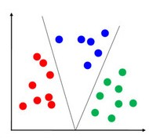

# 1.Machine Learning ?
- Hum machine ko data dete h and machine uss data se learn karta h and find patterns and jab tm uss data se related koi question puchoge to uska answer milega. (jitna jyada data and good algorithm then, utna accha prediction)

- ML = Data + Algorithms → Learn Patterns → Make Predictions

# 2. Types of Machine Learning
i. Supervised Learning
   - Data labeled hota hai (input ke sath output given hota hai).
   - Model ko train karte hain ki kis input ke liye kya output hoga.
   - New input milne par model correct output predict karta hai.
   - Examples: Email spam detection, price prediction, medical diagnosis.

ii. Unsupervised Learning
   - Data labeled nahi hota.
   - Algorithm khud se data ke patterns aur structure find karta hai.
   - Examples: Customer segmentation, market basket analysis.

iii. Reinforcement Learning
   - Agent environment mein action leta hai.
   - Us action ke basis par hi Environment se reward ya punishment milta hai.
   - Model try–error karke best strategy seekhta hai

# 3. Overfitting vs Underfitting
i.Underfitting
   - Model data se achha seekh nahi paaya
   - Training data ,Testing data ,New data pe Accuracy low

ii.Overfitting
   - Model ne training data yaad kar liya
   - Training data pe accuracy high
   - Testing  and New data pe accuracy low
   - 

# 4. Regression
- output ek number hota hai.
- Example:
   Ghar ka price predict karna (₹25 lakh, ₹50 lakh, ₹1 crore)
   Temperature predict karna (29.5°C, 32.7°C)

* Classification
- Output ek category (label) hoti hai — jaise “yes/no” , “cat/dog” , Spam / Not Spam etc.

* Clustering
- Tumhare pass unlabelled data h and model khud se pattern find karke similar data points ko ek group me rakhta h.
   Example:-
      - Tumhare paas ek bag me fruits hain: apples, oranges, bananas.
      - Tumhare paas labels nahi hain (kya apple kya orange pata nahi).
      - Tum naturally color, size, shape dekh ke group bana doge → yeh hi clustering hai.

# 5. Linear Regression
- It is a  supervised learning and used for Regression problems.
- output of  Linear Regression lie b/w  -infinity to +infinity.
- It gives the relationship b/w 2 variables ( one is dependent variable(y) (output) and another is independent(x) (input) )
- y=mx+c  (x-independent variable , y - dependent variable)

- old data se pattern sikhta h and fir new data par prediction karta h.

- linear regression me ek straight line banta h and Agar data point line ke paas hai → model ne us data point ko sahi predict kiya hai (kam error).
   Agar data point line se door hai → model ka prediction galat ya inaccurate hai (zyada error).

- Graph -> 

- Note:- 
        Line ke paas wale data = good fit points (low error)
       Line se dur wale data = outliers / poorly fitted points (high error)

Note:-
Assumption -> Kuch aisi cheezein jo hum model me maante hain, bina prove kiye, tabhi model sahi kaam karega.

* Assumptions of the Linear Regression
i.Linearity:- The relationship between inputs (X) and the output (Y) is a straight line.

ii. Agar model ne ek data point ke liye galti ki —
to agle data point me galti uske effect se free honi chahiye.
Yani model har observation ke liye independently kaam kare,
na ki pehle wale galti se influence ho jaye

📊 Example-1:- Maan lo tumhara model daily temperature predict karta hai.
Day 1: Model ne 30°C instead of 27°C predict kiya (error = +3°C)
Day 2: Model ne 28°C instead of 28°C predict kiya (error = 0°C)
Agar Day 1 par model ne zyada predict kiya tha, to Day 2 ka error usse relate nahi hona chahiye.
Yani model Day 2 me independently kaam kare, Day 1 ke galti ka uske prediction par koi asar na pade.

📊 Example-2:
Day-1 par model ne 10 % zyada predict kiya,
to Day-2 par model automatically zyada ya kam predict na kare — dono galtiyan independent honi chahiye.

* Note:- if x is known so how to find y , m , c
step1: humare paas x and y ka value diya hoga i.e, training dataset
iske help se hum m and c find kar lenge.

| x (Hours Studied) | y (Marks) |
| ----------------- | --------- |
| 1                 | 40        |
| 2                 | 50        |
| 3                 | 65        |
| 4                 | 75        |

step2: use this formula to finc m and c

Now , we get m and c

step2: now kisi bhi particular new x point ke liye y find kar lenge.

Ex:- Netflix algorithm thousands of users ka data use karke m aur c find karta hai (pattern between x & y).
Phir naye user ke liye predict karta hai — “Agar ye itna comedy dekhta hai, to usse ye rating pasand aayegi.”

simply,
Naya data point: “User ne itni comedy dekhi” → x
Linear Regression formula me plug karo → y = predicted rating
Ye numerical value hai, jaise 4.2 stars, 3.7 stars, etc.

# 6. Logistic Regression
- It is a supervised machine learning and used for  classification problems.
- output of  Logistic Regression lie b/w 0 to 1.
- Graph -> 

- logistic regression S-curve explanation:-

Graph Explanation:-
- Blue curve (S-curve) → Sigmoid function → maps input x to probability 0–1
- Red dashed line → Decision threshold = 0.5
- Probability > 0.5 → Class 1
- Probability ≤ 0.5 → Class 0
- Left side of curve → low probability → Class 0
- Right side of curve → high probability → Class 1

Note:- Hum multiple classes me bhi divide kar sakte,like 0 to 0.3 ->class A , 0.3 to 0.6 ->class B ,  0.6 to 1 ->class C

* Assumption:-
  a.Logistic regression is reliable for big dataset , kyunki probability estimate better hota hai.
  b. Errors independent hone chahiye.
     - ek observation ki galti dusre observation
      ki galti ko affect na kare.

# 7. SVM (Support Vector Machine)
- supervised machine learning algorithm hai
- use for classification
- SVM ek boundary line(hyperplane) banata hai jo classes ko alag karta hai
- 

- Note: hum kitne bhi classes me divide kar sakte h.
- Logistic regression me probality decide karte h ki wo output kis class me jayega ,
   But, SVM me humare paas probality jaisa koi concept nbi hota,hume output ko ek particular class me hi dalna padega 

- agar tmhare paas low-dimensional h to logistic regression use kro 
  and agar High-dimensional hai to SVM use kro.

Ex:-
   => Low-dimensional: Tumhare paas sirf height aur weight hai → 2 features → 2D space

   => High-dimensional:Tumhare paas height, weight, age, blood pressure, cholesterol, income, spending score … → 20 features → 20D space

# 8. Decision Tree
- It is a Supervised Machine Learning and used for both Classification aur Regression.
* Yeh algorithm ek tree structure me decisions banata hai:
        - Root Node: jahan se decision start hota hai
        - Internal Nodes: jahan condition lagti hai
        - Leaf Node: final output

* Example : This is classification example :- 
   - Bank tmhe credit card dega ya nhi ?
   - Feature: Income , Credit Score , Age

    Tree:-
                   [Credit Score > 700?]
                 /             \
              Yes               No
             /                    \
    [Income > 50K?]          Reject Loan
       /       \
    Yes         No
   /             \
Approve Loan    Reject Loan

* Advantages:-
i.Handles both categorical and numerical data.
ii.Easy to understand and visualize
iii. No need for feature scaling

* Disadvantages
i. Overfitting
ii. Sensitive to small changes – Slight changes in data can change the tree structure.

* Decision Tree do tarah ke problems ke liye use hota hai: 
      - Classification Tree (Jab output categorical ho)
      - Regression Tree (Jab output numeric ho)

* Applications of Decision Trees
i.Loan Approval in Banking: Banks use Decision Trees to
 assess whether a loan application should be approved.
ii.fail or pass in exam

* When to Use Decision Tree
i.Data mixed types ka ho (numerical + categorical)
ii.Agar aapko model ka decision explain karna hai (e.g., “ye customer loan reject kyun hua”)

# 9. Bagging
- Original data me se randomly kuch data ko select kro
- ab random select kiya hua data pe decision tree train karo.
- jiska majority sabse jyada hoga wahi output hoga.
- Predictions combine karo:
        Classification: majority vote
        Regression: average/mean
- Yaani ek single model par bharosa na karke multiple trees ka opinion liya jata hai.

- Example: Random Forest follows bagging technique

- real life:- Ek question ke liye 10 students independently answer dete hain → majority ka answer final hota hai.

# 10. Boosting
- Pehla tree train karo.
- Jo points galat predict hue → unko zyaada importance (weight) do.
- Agla tree sirf un galti points ko better predict karne ki koshish kare.
- Repeat karte jao → final prediction = sab trees ka weighted combination

- real life:- Ek student step by step apni mistakes  se seekh raha hai → next attempt me galti kam hoti hai

# 11. Random Forest
- It is an extension of Decision Tree.
- Problem it solves: Overfitting of a single Decision Tree
- Technique used by Random Forest : Bagging
- It removes the problem of Decision Tree.(Random forest removes over fitting problem)
- ye algorithm multiple Decision Trees banata hai, aur unka average (regression) ya majority vote (classification) leta hai.
- Decision Tree me hum ek dataset se 1 tree create karte h and random forest me hum multiple tree create karte h and multiple Decision Tree milke forest banata h.
- Har tree thoda alag data aur features pe train hota hai.
  Sab trees milke decision lete hain.

* steps:-
i.Random Forest randomly picks subsets of data (rows) from the original dataset to make each tree.
ii.Each Decision Tree is grown fully
iii.final output
    - Classification : jo tree majority me jo output dega wo final output hoga
    - Regression : Takes average of all tree outputs

* Assumptions of Random Forest:-
i.Each tree makes its own decisions.
ii.Jab hum alag-alag trees ke prediction ko combine
 (average ya vote) karte hain, to final result zyada accurate ho jaata hai.

# 12.Cross Validation
- Model ko sirf training data pe train nahi karte
   Data ko multiple parts me divide kar ke model ki robustness check karte hain

Example:--
Tum ek student ho.
Tumhe ek exam (model test) dena hai, aur tumhare paas 100 sawal (data) hain.
Tum apni performance check karna chahte ho.

* Normal Train-Test Split
Tum kya karte ho:
  - 80 sawal se practice (train) karte ho
  - 20 sawal se test karte ho

👎 Problem:
Ho sakta hai wo 20 sawal aasaan nikle → tumhara score zyada aayega.
Ya mushkil nikle → score kam aayega.

To tumhe apna asli level pata nahi chalega.

solution:-
step-1:- Data ko parts  me divide kro
Maan lo tumhare paas 100 data points hain.
Tum unhe 5 parts me baant lete ho →
(F1, F2, F3, F4, F5)
👉 Ye 5 parts ko hum folds bolte hain.

step-2:- haar baar ek part ko test set ke roop me use karo and remaining part ko training ke roop me use kro

Ab tum 5 baar model chalaoge.
Har baar ek alag fold test ke liye loge,
baaki 4 folds training ke liye.

Step 4:- Phir sab results ka average le lete hain
Tumhe har round ka ek accuracy milti hai:

Ab in sabka average nikal lo:Ye hi final accuracy hai

* Why Use Cross-Validation? (Importance)
i. Avoid Overfitting / Underfitting Misjudgment

# 10. R-squared (R²)
Ab tumhe yeh samajhna hai ki :-
> “Mera model data ko kitna achha samjha raha hai?”
Yahi R² (R-squared) batata hai ❤️
- model ka performance check krne ke liye R-squared ka use krte h.

* Assumption:-
- Errors normal (bell-shape) distribution follow karta h.
- Ek observation ki error dusre par depend na kare

# 10.A. Extended R-squared
- R² hamesha badhta hai jab tum naye variables (predictors)
add karte ho — chahe wo variable kaam ka ho ya bekaar, 
R² increase hi karega.
- exteded R-squared solve this problem.
- 

# 12. CAP Curve (Cumulative Accuracy Profile Curve)
- Ye check karne ke liye ki aapka model sabse zyada likely positive cases ko correctly identify kar raha hai, jaise fraudsters, loan default karne wale log, ya churn hone wale customers.
-  X-axis: % of total population
   Y-axis: % of actual positive 

- Ex: Socho: Tum ek school me top students ko select karna chahte ho based on test score. CAP curve batata hai ki top X% students me kitne sach me top performers hain.

* 

 # 13.XGBoost

XGBoost ek machine learning 
algorithm hai jo Decision Trees par based hota hai,
Socho tumhare paas ek weak model hai jo thoda galat predict karta hai.
XGBoost us model ki galtiyan (errors) ko sikhta hai —
aur next tree ussi galti ko correct karne ki koshish karta hai.

Ye process baar-baar hoti hai → har naya tree pichle model ke errors ko improve karta hai.
Result: accuracy badhti jaati hai

# 14. SVR
SVR is the regression version of SVM.
SVM is used for classification,
SVR is used for regression.

"SVR ek line/curve banata hai jiske aas-paas
ek 'epsilon' ka safe zone hota hai. 
Jo points us zone ke andar hain unko chhota error 
maana jata hai (ignore kiya ja sakta hai).
Jo points is zone se bahar hote hain, 
woh model ko affect karte hain — unhe
'support vectors' kehte hain
Ab simple words me graph samjho 👇
SVR.jpg

--

🟦 Blue Dots (Data Points)

👉 Ye real data hai — jaise actual house prices, marks, ya koi bhi original values.

---

🟩 Green Line (SVR Line)

👉 Ye SVR ka prediction hai —
model ne ye line banayi taaki zyada se zyada blue dots iske paas aayein.

---

🔴 Red Dashed Line (Upper Margin)

👉 Ye epsilon ka upper limit hai —
agar koi point iske andar hai, to uska chhota error ignore kiya jaata hai.

---

🟠 Orange Dashed Line (Lower Margin)

👉 Ye epsilon ka lower limit hai —
iska matlab niche wale errors bhi ignore kiye jaate hain agar ye margin ke andar hain.

---

⚫ Black Circle (Support Vectors)

👉 Ye important points hain —
jo margin ke bahar ya bilkul border par hain.
Model sirf in points ko use karta hai line adjust karne ke liye.

---

💭 Ek line me samjho:

> SVR ek green line banata hai jo data ke beech se jaati hai,
red–orange dashed lines uske aas-paas ek safe zone (margin) banate hain,
aur black circled points wahi important points hote hain jo model ko sikhate hain —
inhe hi Support Vectors kehte hain ✅

# 15. Confusion Matrix

|                     | Predicted Positive    | Predicted Negative    |
| ------------------- | --------------------- | --------------------- |
| **Actual Positive** | ✅ TP (True Positive)  | ❌ FN (False Negative) |
| **Actual Negative** | ❌ FP (False Positive) | ✅ TN (True Negative)  |

Example:
Maan lo ek model predict karta hai ki patient ko disease hai ya nahi.

   TP: Model ne “Disease hai” bola aur actually disease tha.
   TN: Model ne “Disease nahi hai” bola aur actually disease nahi tha.
   FP: Model ne “Disease hai” bola par actually nahi tha.
   FN: Model ne “Disease nahi hai” bola par actually tha.
  
Accuracy=TP+TN/TP+TN+FP+FN

Precision= TP/TP+FP

Recall=TP/TP+FN

F1 Score=2× (Precision+Recall)/ (Precision×Recall)

​

